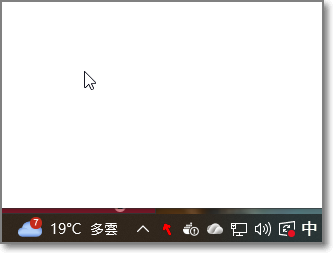
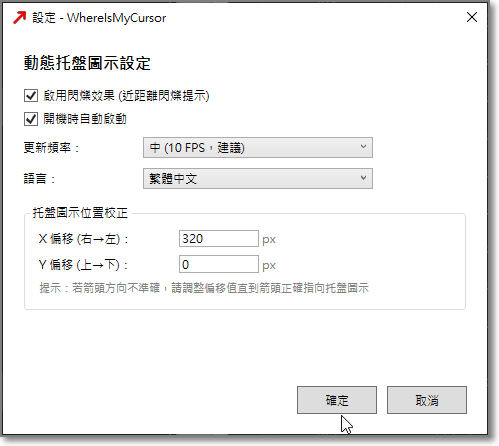

# WhereIsMyCursor User Manual

## Table of Contents

1. [Introduction](#introduction)
2. [Download and Installation](#download-and-installation)
3. [Basic Operations](#basic-operations)
4. [Understanding the Icon Indicators](#understanding-the-icon-indicators)
5. [Settings Guide](#settings-guide)
6. [FAQ](#faq)

---

## Introduction

WhereIsMyCursor is a Windows desktop utility designed for multi-monitor or large screen users. When you lose track of your mouse cursor, just glance at the system tray icon to instantly know the cursor's direction and distance.

### Key Features

- System tray icon displays a real-time arrow pointing to the cursor
- Color indicates cursor distance (red=near, green=far)
- Blink frequency reinforces distance perception
- Auto-start on Windows startup
- Multi-language interface (Traditional Chinese / English)

---

## Download and Installation

### System Requirements

- Operating System: Windows 10 or Windows 11
- Runtime: [.NET 8 Runtime](https://dotnet.microsoft.com/download/dotnet/8.0)

### Installing .NET 8 Runtime

If your computer doesn't have .NET 8 Runtime installed:

1. Go to the [.NET 8 download page](https://dotnet.microsoft.com/download/dotnet/8.0)
2. Under ".NET Desktop Runtime", download the version for your system (usually x64)
3. Run the installer and follow the instructions

### Downloading the Program

1. Go to the [GitHub Releases](https://github.com/ader/WhereIsMyCursor/releases) page
2. Download the latest `WhereIsMyCursor-vX.X.X.zip`
3. Extract to your preferred location (e.g., `C:\Tools\WhereIsMyCursor`)

### Starting the Program

1. Open the extracted folder
2. Run `WhereIsMyCursor.exe`
3. The program will minimize to the system tray (notification area at bottom-right)
4. You'll see a dynamic arrow icon appear in the tray area

---

## Basic Operations

### Tray Icon

After running, a dynamic arrow icon appears in the system tray:

- **Arrow Direction**: Points to the current cursor position
- **Arrow Color**: Indicates distance from cursor to tray
- **Blink Effect**: Blinks when cursor is nearby

### Right-Click Menu

Right-click the tray icon to show the menu:

| Option | Function |
|--------|----------|
| Settings... | Open settings window |
| Exit | Close the program |

---

## Understanding the Icon Indicators

### Distance Visual Indicators

Icon color and blink frequency represent the distance between cursor and system tray, divided into 10 levels:

| Level | Distance Range | Arrow Color | Blink Interval |
|-------|---------------|-------------|----------------|
| 0 | 0 - 400px | Red (#FF0000) | 150ms (fast) |
| 1 | 400 - 800px | Red-Orange (#FF2D00) | 200ms (fast) |
| 2 | 800 - 1200px | Orange-Red (#FF5A00) | 200ms (fast) |
| 3 | 1200 - 1600px | Orange (#FF8700) | 300ms (fast) |
| 4 | 1600 - 2000px | Orange-Yellow (#FFB400) | 300ms (medium) |
| 5 | 2000 - 2400px | Yellow (#FFE100) | 400ms (medium) |
| 6 | 2400 - 2800px | Yellow-Green (#D4F000) | 500ms (slow) |
| 7 | 2800 - 3200px | Light Green (#A0FF00) | 700ms (slow) |
| 8 | 3200 - 3600px | Green (#6CFF00) | 1000ms (very slow) |
| 9 | ≥ 3600px | Bright Green (#48FF00) | No blink |

The blink pattern uses asymmetric opacity toggle (80% visible / 20% dim), staying bright most of the time.

---

## Settings Guide

Right-click the tray icon and select "Settings..." to open the settings window.

### Enable Blinking Effect

- **On**: Arrow blinks based on distance
- **Off**: Arrow stays solid, only color indicates distance

Recommended to keep on, as blinking provides additional distance perception.

### Start with Windows

- **On**: Program launches automatically after Windows login
- **Off**: Manual launch required

When checked, the program will auto-start and stay in the system tray after Windows login.

### Update Frequency

Controls how often the arrow icon updates:

| Option | Update Rate | Description |
|--------|-------------|-------------|
| Low (2 FPS, power saving) | 2 times/sec | Lower resource usage, arrow movement is choppy |
| Medium (10 FPS, recommended) | 10 times/sec | Balanced smoothness and performance |
| High (30 FPS, smooth) | 30 times/sec | Very smooth, uses more resources |

Recommended to use "Medium" unless you need smoother visuals.

### Language

Select interface language:

- **繁體中文**: Traditional Chinese
- **English**: English interface

After switching language, settings window and right-click menu update immediately.

### Tray Icon Position Calibration

Due to system limitations, the program cannot precisely determine the tray icon's actual position, so offset adjustment is provided:

#### X Offset (right → left)

- Default: 100
- Higher value moves target position further left
- If arrow points too far right, increase this value
- If arrow points too far left, decrease this value

#### Y Offset (top → bottom)

- Default: 0
- Positive: Target moves down
- Negative: Target moves up
- If arrow points too high, increase this value
- If arrow points too low, decrease this value

#### Calibration Method

1. Move cursor about 200px directly above the tray icon
2. Check if arrow correctly points downward
3. If pointing left or right of target, adjust X offset
4. If pointing above or below target, adjust Y offset
5. Click "OK" to apply and test again

---

## FAQ

### Q: Why is the arrow direction inaccurate?

A: Adjust the X/Y offset values in settings. Different computers have different taskbar positions and tray configurations, so fine-tuning may be needed.

### Q: Does the program use a lot of system resources?

A: Resource usage is very low under normal use. If concerned about performance, set update frequency to "Low".

### Q: How do I make it start automatically?

A: Open settings and check "Start with Windows".

### Q: How do I change the language?

A: Open settings, select your language from the "Language" dropdown, then click "OK".

### Q: How do I completely close the program?

A: Right-click the tray icon and select "Exit".

### Q: Are settings saved?

A: Yes. Settings are automatically saved to `%APPDATA%\WhereIsMyCursor\settings.json` and loaded on next launch.

### Q: Does it support multiple monitors?

A: Yes. The arrow points to the cursor on any connected monitor.

### Q: Does it work when taskbar is on the side or top?

A: Yes. The program automatically detects taskbar position and adjusts calculations.

### Q: How do I uninstall?

A:
1. Close the program (right-click tray icon → Exit)
2. If "Start with Windows" was enabled, uncheck it first
3. Delete the program folder

---

## Support

For issues or suggestions, please submit to [GitHub Issues](https://github.com/ader/WhereIsMyCursor/issues).
